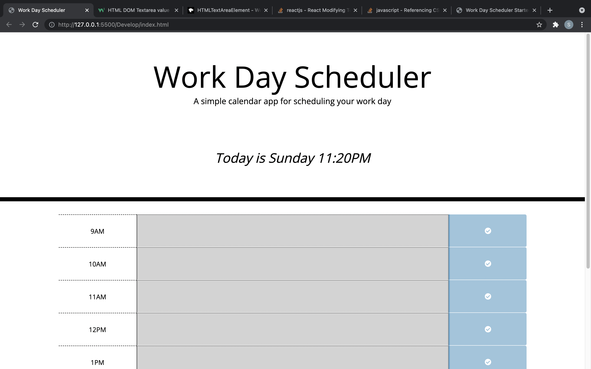

# Work Day Scheduler Starter Code

repo: https://github.com/sihayah/work-day-scheduler

deployment: https://sihayah.github.io/work-day-scheduler/

This is a work day planner application. The heading shows the current day and time. Below, the user can enter hourly events through a nine to five schedule. They can alos save, and update those events. The current hours are color coded accoring to past, present, or future status.